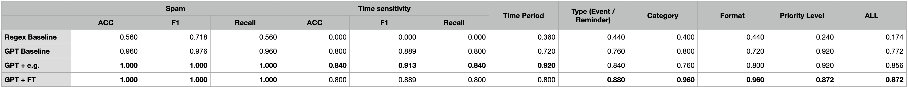

# Automatic-Scheduler
This is modified by Haoyuan. A dev branch.

## Background
In current era, information is exploding -- and to get useful info among all is tricky and 
challenging. Take email as an example: you receive tens, even hundreds of them per day; those 
includes promotions, appointments, casual catch-up with old friends, etc. While most of them are not
very important, and ignoring them will not effect your daily life; some, in the mean while, are very
time-sensitive -- a newly scheduled meeting, a change on your group seminar, an interview 
invitation, etc. How can you manage those information with an easier manner?

## Proposal Statement
By proposing this project, we aims at automatically catching important, and timely information;
after that, we can make them into a template-based schedule instance which can be easily (hopefully 
automatically) add to your calendar.

## Scope
What we hope to do can be sketched as:
- Identify the time-related information in emails
- Templating them into an unified form
- Categorizing them
- Is it a schedule (with a period of time); or a reminder (at one moment)

## Data
- From open dataset
  - Real Emails from: [MailEx](https://github.com/salokr/email-event-extraction?tab=readme-ov-file) (Not actually used) and [atari email archive](https://github.com/voberoi/atariemailarchive-data)
  - Spam Emails from: [Enron Spam Data](https://github.com/MWiechmann/enron_spam_data)
- Pseudo email with mannual labels
  1. anually write 30 labels First
  2. Prompt GPT to genrate emails

## Work Flow:
### 0. Design Template
For a email containing an event/reminder, we believe the following template gives a detailed description:
{
    **"Spam"**: "Yes" / "No",
    **"Subject"**: ,
    **"Sender"**: ,
    **"send_date"**: ,
    **"Time_Sensitive"**: "Yes" / "No",
    **"Start"**: ,
    **"End"**: ,
    **"Type"**: "Event" / "Reminder" / "N/A",
    **"Category"**: "Work" / "Study" / "Leisure",
    **"Format"**: "Online" / "In-person",
    **"Location"**: ,
    **"Action_Required"**: "Yes" / "No",
    **"Priority_Level"**: "Low" / "Medium" / "High" / "Urgent" 
},
### 1. Data and Collecting and Labeling
- Pseudo Emails
  - Manually write 30 [Pseudo Labels](./data/pseudo_email_labels_refined_manually.json) 
  - Prompt GPT API to generate emails according to the label. The [script](./generate_pseudo_email.ipynb)
    - To make generation more natural, we use real email data as examples.
  - Generated emails are placed [./data/pseudo_emails](./data/pseudo_emails) (30)
- Hybridly label real emails [real email labels](./data/raw_email_labels_refined.json)
  - Use Chatgpt API to label real emails first
  - Manually check comparing with content
  - (Human-in-loop calibration)
  - Raw Atari emails are placed [./data/raw_emails](./data/raw_emails) (25); spams are placed [./data/spam_emails](./data/spam_emails)(7)

- Finally, mixed up and split:
  - [Train](./data/PAIRED_train.json): 37 emails with labels
  - [Test](./data/PAIRED_test.json): 25 emails with labels

### 2. Methodology:
- **Baseline 1: Regex**
  - We use keyword matching for the templates
- **Baseline 2: GPT w/ prompting**
  - We prompt GPT with the task requirements, template and required fields.
- **Method 1: GPT w/ Prompting + Examples**
  - We prompt GPT with the task requirements, template and required fields.
  - We also randomly sample 4 email-label pairs from training set, add to the tail of prompt.
- **Method 2: GPT w/ Instruction Tuning**
  - We prompt GPT with the task requirements, template and required fields + **one email example** from train set
  - Use the label as desired response to fine-tune GPT

### 3. Experiments
- Model: **GPT4o-mini**, for email generation, labeling and fine-tuning
- Evaluation:
  - Although all fields are important, not all are easy to evaluate;
  - We only evaluate the following fields:
    - Spam
    - Time_Sensitive
    - Time_Period
    - Type:
    - Category
    - Format
    - Priority_Level
  - A final score for each email is:
    - $\text{Score} = f_s(\text{spam}) \times \sum\omega_i  f_s(field_i)$
    - $f_s$ as a score function, $f_s(\text{pred}, \text{true}) = 1$ if pred = true
    - $\omega_i$ is the weight for $field_i$

### 4. Results: 

